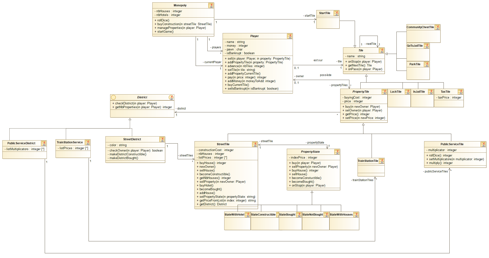
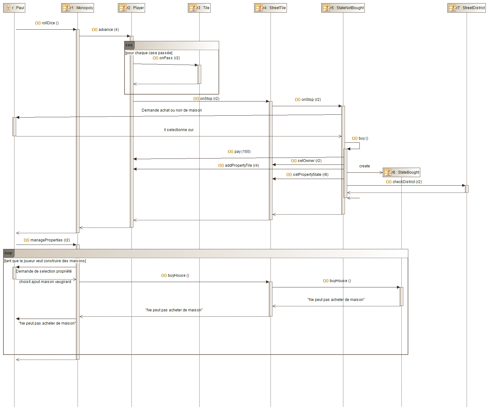
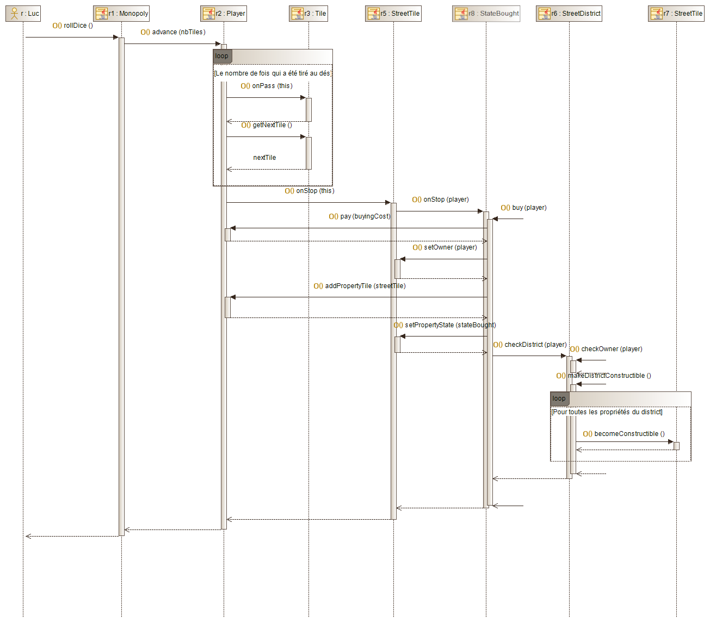
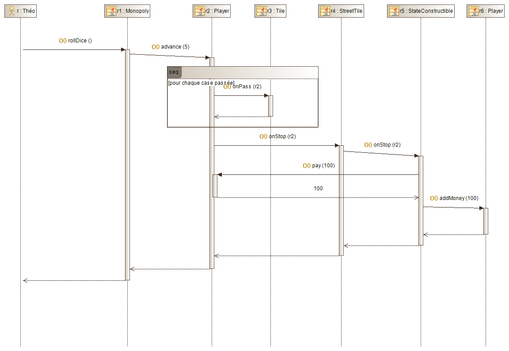
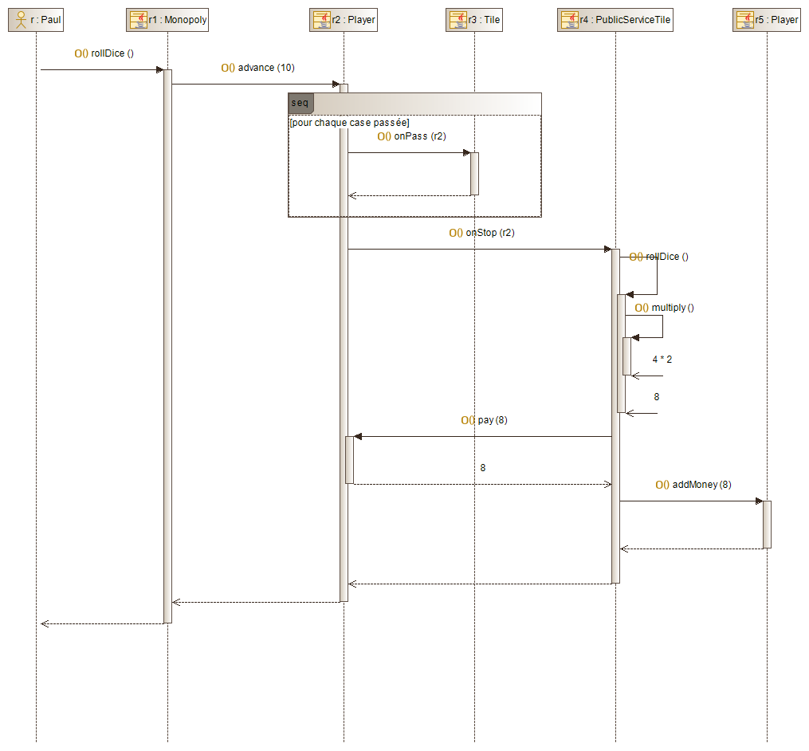
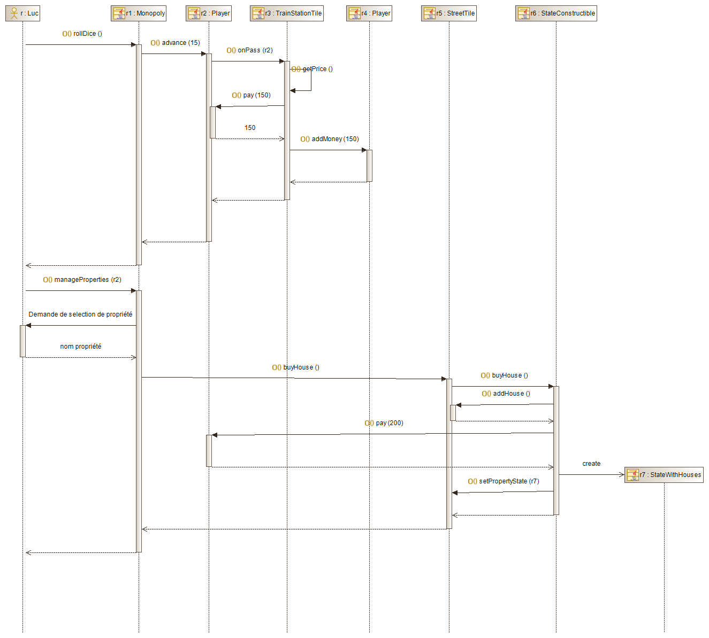
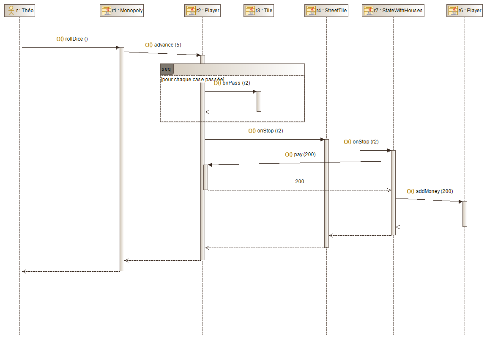

# Compte Rendu INFO703 COO - Monopoly
#### Antoine DEPOISIER, Volodia FERNANDEZ, Mathis TANGHE - M1 INFO 2022

Si les images ne s'affichent pas, elles sont à disposition dans le dossier imagesMD.

## Diagramme de classes

  

## Scénario 1.2

Paul lance les dés et atterrit sur la case « rue de Vaugirard ». Cette case est libre de
propriétaire. Il décide de l’acheter. Son compte est débité du prix de cette propriété. Il
souhaiterait par ailleurs y construire une maison. Il ne peut pas pour le moment car
tout le quartier ne lui appartient pas. Il n’a rien d’autre à faire (pas de construction
possible non plus sur ses autres terrains) : il passe la main (fin de son tour).

  

## Scénario 2.1

Luc lance les dés. Il atterrit sur la case « rue de la Paix ». Il est tout content car il
possède d’ores et déjà les autres propriétés du même quartier. En achetant celle-là, il
aura la totalité du quartier ce qui augmentera les loyers lorsque les autres joueurs y
atterriront. Le quartier va également devenir constructible. Il achète la rue de la Paix.
Il n’a pas les moyens d’acheter des maisons dans ce quartier pour le moment et ne
souhaite pas en acheter ailleurs. Il passe la main.

  

## Scénario 2.2

Théo lance les dés. Il atterrit sur la case « rue de la Paix » que Luc vient tout juste
d’acheter. Il doit payer un loyer à Luc, d’autant plus élevé que Luc possède le quartier
complet. Son compte est débité du montant du loyer. Celui de Luc est crédité de ce
même montant. Il passe la main.

  

## Scénario 2.3

Paul lance les dés. Il atterrit sur la case « services des eaux ». Elle appartient à Théo.
Théo n’a qu’une seule propriété « service » . Paul lance les dés pour savoir combien il
doit payer à Théo. Par chance, le score des dés est 2. Il doit de fait payer la taxe de
base à Théo 4 * 2. Si Théo avait été propriétaire des 2 services, le score
du dé aurait été multiplié par 10 au lieu de 4.

  

## Scénario 2.4

Luc lance les dés. Il atterrit sur la case « gare Montparnasse » . Cette case appartient à
Paul de même que 2 autres gares. Il doit payer à Paul le montant de la taxe de passage
pour une gare, multiplié par 3 puisque Paul possède 3 gares. Le compte de Luc est
débité du montant de la taxe. Celui de Paul est crédité de ce même montant.

Luc profite par ailleurs de son tour pour construire. Il possède deux quartiers en
totalité, le bleu marine, dans lequel se situe la « rue de la Paix », et le vert. C’est ce
que lui indique le jeu en lui fournissant le nom des rues de ces quartiers. Il peut choisir
de construire dans chacune. Il indique qu’il veut construire sur la « rue de la Paix ». Il
a suffisamment d’argent pour cela. La transaction se réalise : la « rue de la Paix »
accueille désormais une maison. Il passe alors la main.

  

## Scénario 2.5

Théo lance les dés. Manque de bol, le voilà qui tombe à nouveau sur la « rue de la
Paix ». Elle est toujours à Luc et, cette fois-ci, il y a une maison dessus. Il va devoir
payer cher... Par chance il lui reste encore de l’argent. Il n’a donc pas besoin de
vendre une de ses propriétés. Il ne peut cependant plus faire grand-chose, faute de
moyens, et espère qu’il pourra se renflouer dans les tours à venir. Il passe la main.

  

